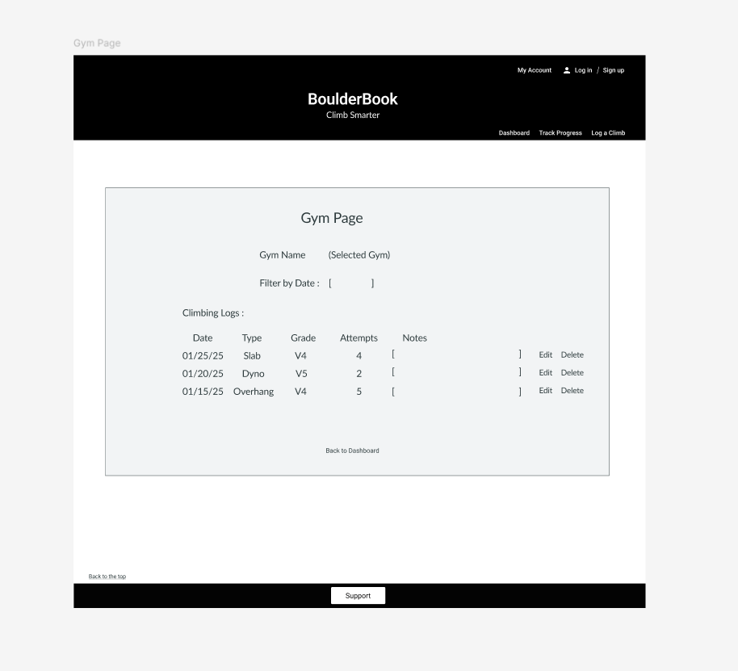

# Screen Design

### **Dashboard (Home Page)**
Shows gyms the user visits, quick actions, and top 5 hardest climbs. Users click on a gym to view logs.  

---

### **Gym Management Page**
Users can add, edit, or delete gyms.  

---

### **Gym Page (Climbing History for a Specific Gym)**
When a user clicks on a gym, it shows all climbing logs for that gym, filtered by date.  

---

### **Log a Climb Page**
Users log climb details (date, type, grade, attempts) under a selected gym.  

---

### **Track Progress Page**
Shows climbing trends, progress over time, highest climbs, and statistics.  

---

### **Login Page**
Users enter credentials to log in.  

---

### **Sign-Up Page**
New users register an account.  

---

### **User Profile Page**
Users update their name, password, and preferences.  

